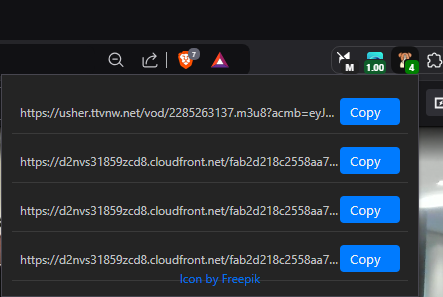

# M3U8 Sniffer Extension

This Chrome extension captures `.m3u8` URLs from specific streaming sites (like Twitch and Kick) as you browse and displays them in a popup window. You can easily copy any URL from the list to your clipboard.

## ScreenShot

## Features

- **URL Capture**: Detects and captures `.m3u8` URLs from specific domains.
- **Clipboard Copy**: Quickly copy URLs to your clipboard directly from the popup.
- **Tab-Specific URLs**: Captures and displays URLs specific to the current tab.

## Installation

1. **Clone or Download** the repository to your local machine.
2. Open **Chrome** and go to `chrome://extensions/`.
3. Enable **Developer Mode** (top right corner).
4. Click on **Load unpacked** and select the folder containing the extension files.

## Usage

1. Navigate to any website where `.m3u8` URLs are generated (such as Twitch VODs or Kick).
2. Open the extension popup by clicking the extension icon in the toolbar.
3. Captured URLs will appear in a list with a "copy" button next to each URL.
4. Click **Copy** to copy any URL to your clipboard.

## License

This project is licensed under the [MIT](https://choosealicense.com/licenses/mit/) License.
